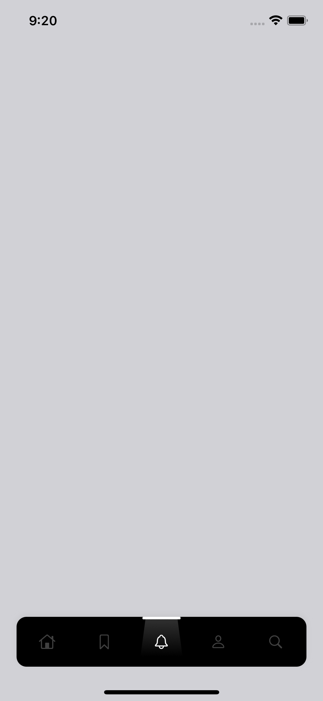
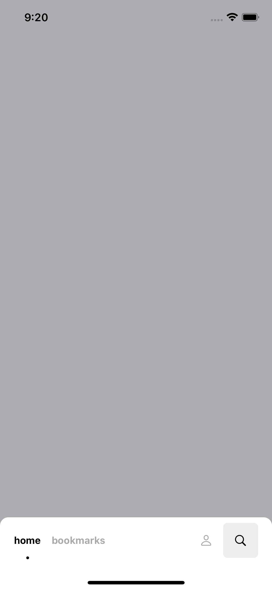
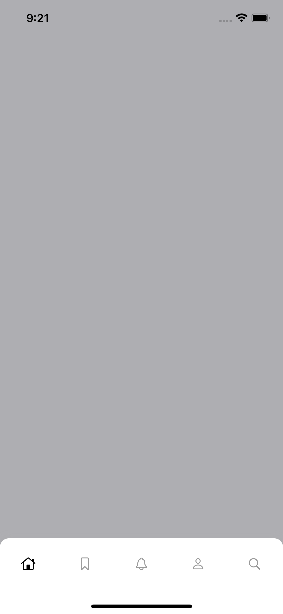
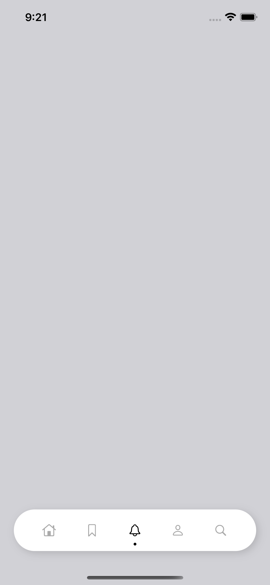

#  LightCardTabBar

An expiremental project exploring different types of custom-tabbar styles, screenshots as below.

## Screenshots

     
     
     
     

## Implementation

The implementation relies on two main components:
    - TabBarController -> which hides the default tabbar and initializes the custom tabbar, and any nesscary components
    - BaseCardTabBar -> A base class for any client who wishes to implement custom tab bar, including any actions needed.
    
    
## Examples

The Example Project includes **4 styles** of custom-tabbar, crafted and inspired by well made designs.

Each type of tabbar has the two main components, it's own **tabbarcontroller** and **tabbar**, all have the same inteface to interact with.

## Your own tabbar!

The Example project demonstrates different types of tabbar represents a wide range of applications you can use, I hope the examples provide a starting point if you want to implement your own.

And as always, you can pull request a new style!

## License 

Copyright 2021 Hussein AlRyalat

Permission is hereby granted, free of charge, to any person obtaining a copy of this software and associated documentation files (the "Software"), to deal in the Software without restriction, including without limitation the rights to use, copy, modify, merge, publish, distribute, sublicense, and/or sell copies of the Software, and to permit persons to whom the Software is furnished to do so, subject to the following conditions:

The above copyright notice and this permission notice shall be included in all copies or substantial portions of the Software.

THE SOFTWARE IS PROVIDED "AS IS", WITHOUT WARRANTY OF ANY KIND, EXPRESS OR IMPLIED, INCLUDING BUT NOT LIMITED TO THE WARRANTIES OF MERCHANTABILITY, FITNESS FOR A PARTICULAR PURPOSE AND NONINFRINGEMENT. IN NO EVENT SHALL THE AUTHORS OR COPYRIGHT HOLDERS BE LIABLE FOR ANY CLAIM, DAMAGES OR OTHER LIABILITY, WHETHER IN AN ACTION OF CONTRACT, TORT OR OTHERWISE, ARISING FROM, OUT OF OR IN CONNECTION WITH THE SOFTWARE OR THE USE OR OTHER DEALINGS IN THE SOFTWARE.
